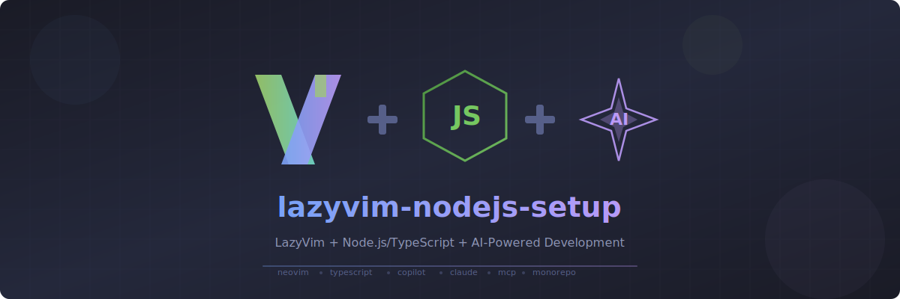

<p align="center">
  
</p>

# lazyvim-nodejs-setup

A LazyVim-based Neovim configuration optimized for Node.js/TypeScript development with extensive AI integration. Features a modular plugin architecture, performance optimizations for large monorepos, and seamless AI-assisted coding workflows.

## Features

- **LSP Integration**: vtsls for TypeScript/JavaScript, eslint, lua_ls, bashls, html
- **Intelligent Completion**: blink.cmp with LSP, Copilot, snippets, and buffer sources
- **AI-Powered Coding**: CodeCompanion with Claude, GitHub Copilot, and MCP server support
- **Fuzzy Finding**: Telescope with FZF native, file browser, and undo history
- **Git Integration**: Gitsigns with inline blame, LazyGit
- **Modern UI**: Sonokai theme, bufferline, lualine, noice.nvim, floating filename indicators
- **Performance Optimized**: Lazy-loading, large file handling, monorepo-tuned LSP settings

## Installation

### Quick Install

```bash
# Backup existing config
mv ~/.config/nvim ~/.config/nvim.bak

# Clone this repository
git clone https://github.com/user/lazyvim-nodejs-setup ~/.config/nvim

# Start Neovim (plugins will auto-install)
nvim
```

### Requirements

- [Neovim](https://neovim.io/) 0.10+
- [Git](https://git-scm.com/)
- [Node.js](https://nodejs.org/) and npm/yarn/pnpm
- [ripgrep](https://github.com/BurntSushi/ripgrep) for telescope live grep
- [fd](https://github.com/sharkdp/fd) for telescope file finding
- [lazygit](https://github.com/jesseduffield/lazygit) (optional) for git UI
- [yazi](https://github.com/sxyazi/yazi) (optional) for file manager
- [Python 3](https://www.python.org/) (optional) for vault graph generator
- [deno](https://deno.land/) (optional) for markdown preview (peek.nvim)
- A [Nerd Font](https://www.nerdfonts.com/) for icons

## Key Bindings

### Navigation

| Key | Action |
|-----|--------|
| `;f` | Find files |
| `;r` | Live grep |
| `;d` | Grep in directory |
| `\\` | Open buffers |
| `sf` | File browser |
| `s` | Flash jump |
| `S` | Treesitter jump |

### Window/Tab Management

| Key | Action |
|-----|--------|
| `ss` / `sv` | Split horizontal/vertical |
| `sh/sj/sk/sl` | Navigate windows |
| `te` / `ta` / `tw` | New tab edit/add/close |
| `<Tab>` / `<S-Tab>` | Next/prev buffer |

### LSP

| Key | Action |
|-----|--------|
| `gd` | Go to definition |
| `gr` | Go to references |
| `gi` | Go to implementation |
| `<Leader>ca` | Code actions |
| `<Leader>rn` | Rename symbol |

### AI Integration

| Key | Action |
|-----|--------|
| `<Leader>av` | AI chat (vertical split) |
| `<Leader>as` | AI chat (horizontal split) |
| `<Leader>at` | AI chat (new tab) |
| `<Leader>ax` | Send selection to chat |
| `<Leader>ag` | Claude Code agent (dedicated tmux session) |
| `<Leader>ah` | MCP server manager |

### Git

| Key | Action |
|-----|--------|
| `<Leader>gh` | Preview hunk |
| `<Leader>gt` | Toggle inline blame |
| `<Leader>gb` | Git blame |
| `<Leader>gg` | LazyGit |

### Markdown / Obsidian

| Key | Action |
|-----|--------|
| `<Leader>md` | Markdown preview |
| `<Leader>mq` | Close markdown preview |
| `<Leader>mo` | Obsidian graph (multi-workspace vis.js graph with vim navigation) |

### File Management

| Key | Action |
|-----|--------|
| `<Leader>fe` | File explorer (nvim-tree) |
| `<Leader>fm` | Yazi file manager |

## Project Structure

```
~/.config/nvim/
├── init.lua                 # Entry point
└── lua/
    ├── config/
    │   ├── lazy.lua         # Plugin manager setup
    │   ├── options.lua      # Editor settings
    │   ├── keymaps.lua      # Key bindings
    │   ├── autocmds.lua     # Auto-commands
    │   └── confirm.lua      # Custom save confirm dialog
    ├── plugins/
    │   ├── lsp/             # LSP, completion, mason
    │   ├── editor/          # Telescope, treesitter, UI
    │   ├── ai/              # CodeCompanion, Copilot, MCP
    │   ├── git/             # Gitsigns, LazyGit
    │   └── other/           # Clipboard, which-key, markdown/obsidian
    ├── scripts/
    │   └── vault-graph.py   # Obsidian vault graph generator
    └── utils/
        └── node_resolver.lua  # Shared nvm-aware node binary resolver
```

## AI Setup

### GitHub Copilot

1. Run `:Copilot auth` to authenticate
2. Copilot suggestions appear in completion menu

### CodeCompanion

Uses GitHub Copilot's Claude model by default. Configure API keys in environment or adapter settings for direct API access.

### MCP Servers

Manage MCP servers with `<Leader>ah`. Workspace-local config supported via:
- `.mcphub/servers.json`
- `.vscode/mcp.json`

### Obsidian Vault Graph

Set environment variables to point to your Obsidian vaults:

```bash
export PERSONAL_VAULT_PATH="~/path/to/personal/vault"
export WORK_VAULT_PATH="~/path/to/work/vault"
```

Press `<Leader>mo` to generate an interactive vis.js force-directed graph of your vault's `[[wikilinks]]`. The graph includes a workspace selector dropdown and full vim-style keyboard navigation:

| Key | Action |
|-----|--------|
| `h j k l` | Navigate between nodes |
| `f` | Search notes |
| `w` | Switch workspace (j/k to pick) |
| `Enter` | Focus node (zoom into connections) |
| `o` | Open .md file in Neovim |
| `y / n` | Confirm / cancel (in modal) |
| `ESC` | Go back (focus → selection → search → reset) |

Click on a label to open the file. When Neovim is outside the vault, files auto-open in a dedicated tmux "vault" window (falls back to a confirm modal without tmux).

The script can also be run standalone:

```bash
python3 lua/scripts/vault-graph.py --all          # all workspaces
python3 lua/scripts/vault-graph.py -w personal     # specific workspace
python3 lua/scripts/vault-graph.py ~/my-vault      # arbitrary path
```

## Performance Notes

- **Large files**: Treesitter disabled for files >500KB
- **Monorepos**: vtsls configured with 4GB memory, project diagnostics disabled
- **Lazy loading**: Plugins load on-demand via commands/keys/events

## Customization

Override settings by creating files in `lua/plugins/` - LazyVim will merge your specs with the defaults.

## License

MIT
